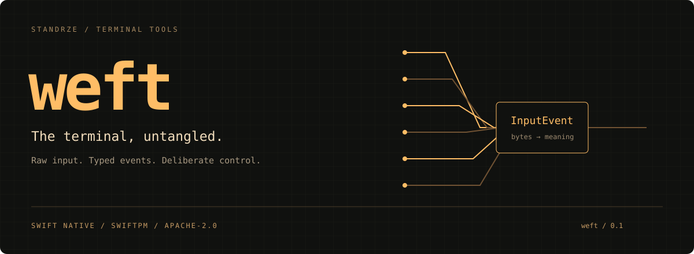

[](https://www.swift.org/)
[](Package.swift)
[](LICENSE)

**Swift terminal infrastructure with explicit ownership.** Open a session, decode
input into typed events, and restore the terminal when you finish. Use it alone
or underneath [loom](https://github.com/standrze/loom).

## From byte stream to keystroke

| Layer | What you get |
| --- | --- |
| Sessions | Raw mode, alternate screen, cursor and mouse policies, restoration |
| Input | Incremental UTF-8, escape sequences, bracketed paste, mouse events |
| Keyboard | Legacy keys and opt-in Kitty keyboard protocol support |
| Events | Asynchronous input and resize delivery through `TerminalEvents` |
| Output | A small `Backend` protocol, ANSI output, terminal commands |
| Geometry | Cell widths, points, rectangles, terminal capability detection |

Rendering is optional. There is no dependency on loom or an application framework.

## Add it with SwiftPM

Requires **Swift 6.4+**. The package declares **macOS 13+** and includes Linux
terminal code; this initial release was validated locally on macOS. Linux support
has not been verified for this release.

Add the package dependency:

```swift
.package(url: "https://github.com/standrze/weft.git", from: "0.1.0")
```

Then add its product to your target's dependencies:

```swift
.product(name: "weft", package: "weft")
```

The module name is lowercase: `import weft`.

## Decode without opening a terminal

```swift
import weft

var decoder = InputDecoder()
let events = decoder.feed(Array("\u{1b}[A".utf8))
assert(events == [.key(.up)])
```

The decoder retains partial sequences between calls. A standalone Escape byte
needs a timeout decision from its caller; call `flushEscape()` once that timeout
expires. `TerminalSession` handles this for interactive use.

## Try a live session

```sh
swift run weft-demo
```

The example opens an alternate screen and prints typed input events. Press
**Escape** or **Ctrl-C** to exit. It uses `TerminalEvents` on the main actor and
stops the event source before closing its session.

See [the example](Examples/Demo/Demo.swift) and [session ownership](Documentation/Architecture.md).

## Development

```sh
scripts/check-format.sh
swift test
swift build --product weft-demo
python3 scripts/smoke.py .build/debug/weft-demo
```

See [CONTRIBUTING.md](CONTRIBUTING.md). Version `0.1.0` is an early extraction
from ono-sendai; APIs may change before 1.0. Terminal behavior and character widths
vary between emulators and fonts.

## License

[Apache License 2.0](LICENSE). Dependencies retain their own licenses.
The banner is an original SVG included in this repository under the same license.
